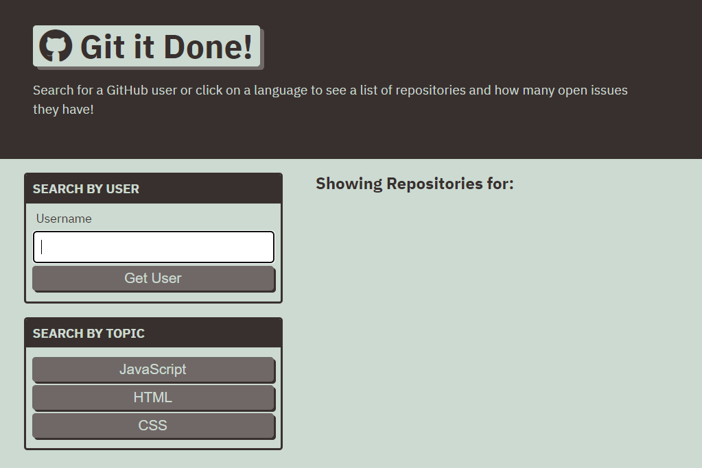

# Git It Done

## Description

A web app for searching GitHub users to display repositories and issues.

This was a project for a coding bootcamp that covered the following skills

- HTML
- JavaScript
- Server-side APIs

## Features

- Search for GitHub users by username to display all their public repositories
- Display issues count on each repo
- Click on a repo to display all issues for the selected repo, each linking to that issue's page
- Display featured repos by language

## Screenshot

## Live Site

[Link](https://jdpasternak.github.io/git-it-done)
